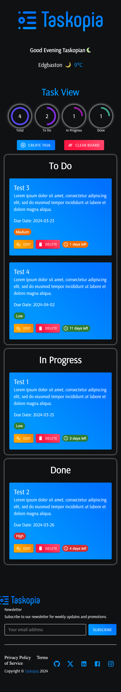

# Taskopia

## Description
Taskopia is a simple Collaborative Task Management App that will allow users to create, share, and manage tasks in a collaborative environment, similar to other popular project management tools. With a twist focusing on real-time collaboration.

## User Story
```
As a project manager, I want to efficiently organize and track tasks across multiple projects, collaborate in real time with my team, and ensure that everyone is aligned on their responsibilities and deadlines.
```

## Core Features
- Task Creation and Management: Users can create tasks with titles, descriptions, due dates, and priorities. Tasks can be edited and updated as needed. The dates are a drop-down calendar view.
- Project Boards: Organize tasks into boards or lists (e.g., To Do, In Progress, Done) for better project management. Users can drag and drop tasks between lists for easy status updates.
- Real-Time Collaboration: Implemented real-time updates so team members can see changes immediately without needing to refresh their screens.
- Universally Unique Identifiers: Providing a reliable way to identify data and to ensure the security and uniqueness of each task with UUIDs.


## Taskopia Application
### [View Application](https://taskopia.netlify.app)

The following images shows Taskopia displaying a working application.


> **Note** This is a screenshot of the deployed Team Profile Generator App.



> **Note** This is a screenshot of the deployed Team Profile Generator Mobile.

## Technologies Used

- [React](https://www.npmjs.com/package/react)
- [Vite](https://vitejs.dev/guide/)
- [Material UI](https://mui.com/material-ui/)
- [React Beautiful DND](https://www.npmjs.com/package/react-beautiful-dnd)
- [Figma](https://www.figma.com/)
- [Node.js](https://nodejs.org/en/)
- [npm](https://www.npmjs.com/)
- [JavaScript](https://www.javascript.com/)
- [HTML](https://developer.mozilla.org/en-US/docs/Web/HTML)
- [CSS](https://www.w3schools.com/css/)

<div >
	
	
	
	
	
	
	
	
	
	
</div>

## Development Team
Tech Titans
- [@adebayoadebisi](https://github.com/adebayoadebisi) Adebayo Adebisi
- [@gelisimduygusu](https://github.com/gelisimduygusu) Yasemin Sahin
- [@texndo](https://github.com/texndo) Rutendo Kuuzabuwe 

## References
[Open Weather API](https://openweathermap.org/api)
[Socket.io](https://www.npmjs.com/package/socket.io)
[Material UI Docs](https://mui.com/)
[Axios](https://axios-http.com/docs/intro)
[useState](https://react.dev/reference/react/useState)

## License
Licensed under [MIT License](LICENSE.md).

## GitHub Repository
URL: https://github.com/adebayoadebisi/Taskopia

## Deployed Application
URL: https://taskopia.netlify.app
